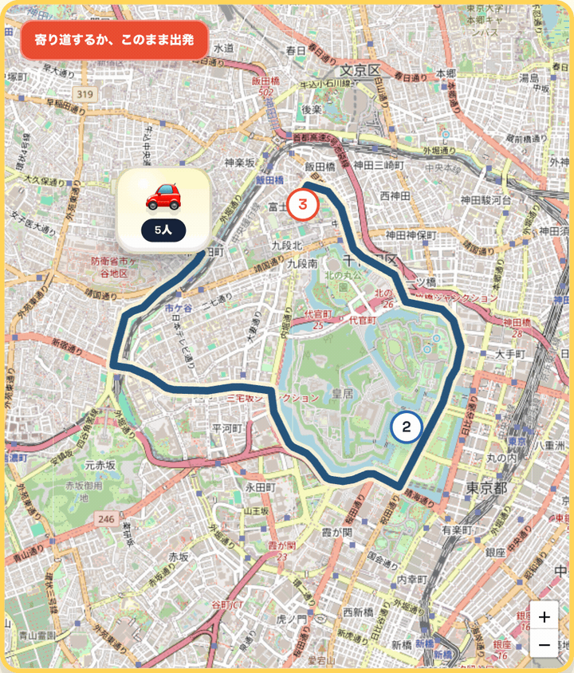
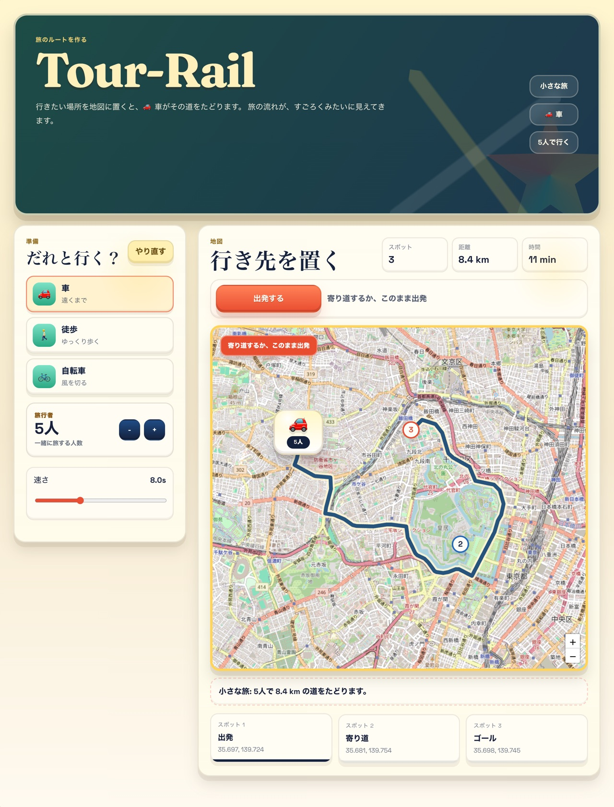

# Tour-Rail

> 地図にスポットを置くと、選んだ移動手段がルートをたどる ── ボードゲーム風の旅行ルート可視化アプリ。
> **React + Vite フロントエンド / FastAPI バックエンド / OSRM 外部 API 連携 / フロント・バック分離デプロイ** を 1 つで示すポートフォリオ作品です。




**🔗 リンク:** ライブデモ（公開準備中 — 手順は [HANDOFF.md](HANDOFF.md)） ・ [アーキテクチャ](docs/architecture.md) ・ [デプロイ手順](docs/deployment.md)

---

Tour-Rail は、地図上で旅行ルートを作成し、ボードゲーム風の演出で移動を可視化する Web アプリです。

就職活動のポートフォリオとして、単に画面を作るだけでなく、フロントエンド、バックエンド、外部 API 連携、デプロイ、動作確認までを一通り実装できることを示す目的で制作しています。

## 概要

ユーザーは地図をクリックしてスタート、ゴール、寄り道スポットを追加し、旅行者数と移動手段を選びます。ルート作成後は、選択した車・徒歩・自転車のアイコンがルートに沿って移動し、ボードゲーム風のカードでも現在地が分かるようになっています。



このアプリは、旅行計画を「距離や時間の情報」だけでなく、「どのルートをどう移動するのか」という体験として見せることを目指しています。

## 解決できる問題・想定需要

Tour-Rail は、次のような場面で役立つ可能性があります。

- 旅行や遠足のルートを、文章や静的な地図だけでなく直感的に共有したい
- 複数人の移動イメージを、視覚的に分かりやすく説明したい
- 観光イベント、地域紹介、研修旅行などで、移動ルートを楽しく見せたい
- 子ども向け、ファミリー向け、教育向けの地理・移動学習コンテンツとして使いたい
- 採用・営業・プレゼン資料で、移動や巡回ルートを分かりやすくデモしたい

一般的な地図アプリは正確なナビゲーションに強い一方で、共有相手に「行程の流れ」や「楽しさ」を伝えるには少し硬くなりがちです。Tour-Rail は、正確なルート情報を扱いながら、ボードゲームのような見た目で説明しやすくすることを狙っています。

## 主な機能

- 地図クリックによるスポットの追加
- 旅行者数の入力
- 車・徒歩・自転車の移動手段切り替え
- FastAPI バックエンド経由でのルート取得
- OSRM を利用したルート、距離、所要時間の取得
- 移動手段アイコンによるルート上の移動アニメーション
- ボードゲーム風のスポット表示
- Render へのフロントエンド・バックエンド分離デプロイ

## 技術構成

| 領域 | 使用技術 |
| --- | --- |
| フロントエンド | React, Vite, TypeScript, Leaflet |
| バックエンド | FastAPI, Python |
| ルーティング | OSRM |
| デプロイ | Render Static Site, Render Web Service |
| テスト | Python unittest, Vite build |

リポジトリは Render で運用しやすいように、次の構成に分けています。

```text
backend/   FastAPI API
frontend/  React + Vite の静的サイト
docs/      アーキテクチャ・デプロイ補足
render.yaml Render Blueprint 設定
```

## アーキテクチャ

データの流れは次の通りです。

1. フロントエンドが `/config` から初期設定を取得する
2. ユーザーが地図上にスポットを追加する
3. フロントエンドが `/route` にスポット一覧を送信する
4. バックエンドが OSRM に問い合わせる
5. バックエンドがルート、距離、所要時間を正規化して返す
6. フロントエンドが地図、移動アニメーション、ボード風カードを更新する

詳細は [docs/architecture.md](docs/architecture.md) にまとめています。

## API

### `GET /health`

バックエンドの稼働確認用エンドポイントです。Render のヘルスチェックにも使用します。

### `GET /config`

フロントエンドの初期表示に必要な設定を返します。

- ルート色
- ボード色
- 地図の初期中心座標
- 地図の初期ズーム

### `POST /route`

地図上で選択したスポットを受け取り、ルート情報を返します。

リクエスト例:

```json
{
  "waypoints": [
    { "lat": 35.6812, "lng": 139.7671 },
    { "lat": 35.6895, "lng": 139.6917 }
  ]
}
```

レスポンスには次の情報が含まれます。

- `path`: 描画用に正規化された座標リスト
- `waypoints`: ユーザーが指定したスポット
- `distance_m`: 距離
- `duration_s`: 所要時間
- `segment_count`: 区間数

## ローカルでの動作手順

### 1. バックエンドを起動する

```bash
cd backend
python3 -m venv .venv
source .venv/bin/activate
pip install -r requirements.txt
uvicorn main:app --reload --port 8000
```

起動後、次の URL でヘルスチェックできます。

```text
http://localhost:8000/health
```

### 2. フロントエンドを起動する

別ターミナルで実行します。

```bash
cd frontend
npm install
npm run dev
```

通常は次の URL で開きます。

```text
http://localhost:5173
```

ローカル開発では、フロントエンドは標準で `http://localhost:8000` のバックエンドを参照します。別の API URL を使う場合は、`frontend/.env.local` を作成します。

```bash
VITE_API_BASE_URL=http://localhost:8000
```

## アプリの操作手順

1. フロントエンドをブラウザで開く
2. 旅行者数と移動手段を選ぶ
3. 地図上でスタート地点をクリックする
4. 続けてゴール地点をクリックするか、`ゴールを追加` を押す
5. 必要に応じて寄り道スポットを追加する
6. 地図上にルートが表示されることを確認する
7. `移動をスタート` を押す
8. 移動手段アイコンのアニメーションとボード風カードの進行を確認する

## 動作確認テスト

### バックエンド

```bash
cd backend
source .venv/bin/activate
python -m unittest discover -s tests
```

確認内容:

- `/health` が正常に応答する
- `/config` が初期表示設定を返す
- `/route` が不正な入力を検証する
- `/route` が OSRM レスポンスを正しく整形する

### フロントエンド

```bash
cd frontend
npm run build
```

確認内容:

- TypeScript と Vite のビルドが成功する
- 本番配信用の `dist` が生成される
- 環境変数 `VITE_API_BASE_URL` を参照できる状態でビルドできる

### 手動確認

ローカルまたはデプロイ後に、次の流れを確認します。

1. バックエンドの `/health` を開き、正常応答を確認する
2. フロントエンドを開き、画面が表示されることを確認する
3. ブラウザの開発者ツールで `/config` が成功していることを確認する
4. 地図上に 2 点以上のスポットを追加する
5. `/route` が成功し、ルート線が表示されることを確認する
6. 移動手段アイコンがルートに沿って移動することを確認する

## Render へのデプロイ手順

このリポジトリには、Render Blueprint 用の [render.yaml](render.yaml) を用意しています。

作成されるサービスは次の 2 つです。

- `tour-rail-api`: FastAPI の Web Service
- `tour-rail-web`: React + Vite の Static Site

### Blueprint でデプロイする場合

1. GitHub にこのリポジトリを push する
2. Render にログインする
3. `New` から `Blueprint` を選ぶ
4. このリポジトリを選択する
5. `render.yaml` の内容を確認してデプロイする
6. `tour-rail-api` と `tour-rail-web` のデプロイ完了を待つ
7. `tour-rail-web` の公開 URL を開いて動作確認する

Blueprint では、バックエンド URL が `VITE_API_BASE_URL` としてフロントエンドに渡されます。

### 手動でデプロイする場合

バックエンド:

```text
Root directory: backend
Build command: pip install -r requirements.txt
Start command: uvicorn main:app --host 0.0.0.0 --port $PORT
Health check path: /health
```

環境変数:

```text
OSRM_BASE_URL=https://router.project-osrm.org
ALLOWED_ORIGINS=http://localhost:5173,http://localhost:4173,http://127.0.0.1:5173,http://127.0.0.1:4173
ALLOWED_ORIGIN_REGEX=^https://[a-z0-9-]+\.(onrender\.com|vercel\.app)$
```

フロントエンド:

```text
Root directory: frontend
Build command: npm ci && npm run build
Publish directory: dist
```

環境変数:

```text
VITE_API_BASE_URL=<Render にデプロイしたバックエンドの URL>
```

SPA として直接 URL を開いても表示できるように、Static Site ではすべてのパスを `/index.html` に rewrite します。

## デプロイ後の確認項目

1. `https://<backend-url>/health` が正常に返る
2. フロントエンドの公開 URL を開ける
3. `/config` のリクエストが成功する
4. 地図をクリックしてスポットを追加できる
5. ルート作成後に `/route` が成功する
6. ルート線、距離、所要時間、移動アニメーションが表示される
7. CORS エラーが出ていないことをブラウザの開発者ツールで確認する

本番環境でフロントエンドから API に接続できない場合は、次の設定を確認します。

- `VITE_API_BASE_URL`
- `ALLOWED_ORIGINS`
- `ALLOWED_ORIGIN_REGEX`
- Render のバックエンドサービスが起動しているか

## 今後の改善案

- 旅行プランの保存機能
- 共有 URL の発行
- 複数ルート比較
- 観光スポット情報の表示
- スマートフォン向け操作性の継続改善

## 補足資料

- [AGENTS.md](AGENTS.md)
- [docs/architecture.md](docs/architecture.md)
- [docs/deployment.md](docs/deployment.md)
